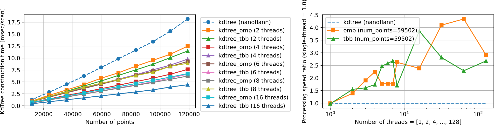

# small_gicp

**small_gicp** is a header-only C++ library providing efficient and parallelized algorithms for fine point cloud registration (ICP, Point-to-Plane ICP, GICP, VGICP, etc.). It is a refined and optimized version of its predecessor, [fast_gicp](https://github.com/SMRT-AIST/fast_gicp), re-written from scratch with the following features.

- **Highly Optimized** : The core registration algorithm implementation has been further optimized from fast_gicp, achieving up to **2x speed gain**.
- **Fully parallerized** : small_gicp offers parallel implementations of several preprocessing algorithms, making the entire registration process parallelized (e.g., Downsampling, KdTree construction, Normal/Covariance estimation). It supports [OpenMP](https://www.openmp.org/) and [Intel TBB](https://github.com/oneapi-src/oneTBB) as parallelism backends.
- **Minimum dependencies** : The library requires only [Eigen](https://eigen.tuxfamily.org/) along with the bundled [nanoflann](https://github.com/jlblancoc/nanoflann) and [Sophus](https://github.com/strasdat/Sophus). Optionally, it supports a [PCL](https://pointclouds.org/) registration interface for use as a drop-in replacement
- **Customizable** : small_gicp allows the integration of any custom point cloud class into the registration algorithm via traits. Its template-based implementation enables customization of the registration process with original correspondence estimators and registration factors.
- **Python bindings** : By being isolated from PCL, small_gicp's Python bindings are more portable and can be used seamlessly with other libraries such as Open3D.

Note that GPU-based implementations are NOT included in this package.

If you find this package useful for your project, please consider leaving a comment [here](https://github.com/koide3/small_gicp/issues/3). It would help the author receive recognition in his organization and keep working on this project. Please also cite [the corresponding software paper](https://joss.theoj.org/papers/10.21105/joss.06948) if you use this software in an academic work.


[](https://joss.theoj.org/papers/059b017c823ed9fd211fc91373cdc2cc) [](https://github.com/koide3/small_gicp/actions/workflows/build-linux.yml) [](https://github.com/koide3/small_gicp/actions/workflows/build-macos.yml) [](https://github.com/koide3/small_gicp/actions/workflows/build-windows.yml) [](https://github.com/koide3/small_gicp/actions/workflows/test.yml) [](https://codecov.io/gh/koide3/small_gicp)

## Requirements

This library uses C++17 features. The PCL interface is not compatible with PCL older than 1.11 that uses `boost::shared_ptr`.

## Dependencies

- [Mandatory] [Eigen](https://eigen.tuxfamily.org/), [nanoflann](https://github.com/jlblancoc/nanoflann) ([bundled](include/small_gicp/ann/kdtree.hpp)), [Sophus](https://github.com/strasdat/Sophus) ([bundled](include/small_gicp/util/lie.hpp))
- [Optional] [OpenMP](https://www.openmp.org/), [Intel TBB](https://www.intel.com/content/www/us/en/developer/tools/oneapi/onetbb.html), [PCL](https://pointclouds.org/)

## Installation

### C++

small_gicp is a header-only library. You can just download and drop it in your project directory to use it.

If you need only basic point cloud registration functions, you can build and install the helper library as follows.

```bash
sudo apt-get install libeigen3-dev libomp-dev

cd small_gicp
mkdir build && cd build
cmake .. -DCMAKE_BUILD_TYPE=Release && make -j
sudo make install
```

### Python (Linux / Windows / MacOS)

#### Install from [PyPI](https://pypi.org/project/small-gicp/)

```bash
pip install small_gicp
```

#### Install from source

```bash
cd small_gicp
pip install .

# [Optional (linux)] Install stubs for autocomplete (If you know a better way, let me know...)
pip install pybind11-stubgen
cd ~/.local/lib/python3.10/site-packages
pybind11-stubgen -o . --ignore-invalid=all small_gicp
```

## Documentation

- Auto-generated docs: [C++](https://koide3.github.io/small_gicp/doc_cpp/index.html) [Python](https://koide3.github.io/small_gicp/doc_py/index.html)


## Usage (C++)

The following examples assume `using namespace small_gicp` is placed somewhere.

### Using helper library ([01_basic_registration.cpp](src/example/01_basic_registration.cpp))

The helper library (`registration_helper.hpp`) enables easily processing point clouds represented as `std::vector<Eigen::Vector(3|4)(f|d)>`.
<details><summary>Expand</summary>

`small_gicp::align` takes two point clouds (`std::vectors` of `Eigen::Vector(3|4)(f|d)`) and returns a registration result (estimated transformation and some information on the optimization result). This is the easiest way to use small_gicp but causes an overhead for duplicated preprocessing.

```cpp
#include <small_gicp/registration/registration_helper.hpp>

std::vector<Eigen::Vector3d> target_points = ...;   // Any of Eigen::Vector(3|4)(f|d) can be used
std::vector<Eigen::Vector3d> source_points = ...;   // 

RegistrationSetting setting;
setting.num_threads = 4;                    // Number of threads to be used
setting.downsampling_resolution = 0.25;     // Downsampling resolution
setting.max_correspondence_distance = 1.0;  // Maximum correspondence distance between points (e.g., triming threshold)

Eigen::Isometry3d init_T_target_source = Eigen::Isometry3d::Identity();
RegistrationResult result = align(target_points, source_points, init_T_target_source, setting);

Eigen::Isometry3d T = result.T_target_source;  // Estimated transformation
size_t num_inliers = result.num_inliers;       // Number of inlier source points
Eigen::Matrix<double, 6, 6> H = result.H;      // Final Hessian matrix (6x6)
```

There is also a way to perform preprocessing and registration separately. This enables saving time for preprocessing in case registration is performed several times for the same point cloud (e.g., typical odometry estimation based on scan-to-scan matching).

```cpp
#include <small_gicp/registration/registration_helper.hpp>

std::vector<Eigen::Vector3d> target_points = ...;   // Any of Eigen::Vector(3|4)(f|d) can be used
std::vector<Eigen::Vector3d> source_points = ...;   // 

int num_threads = 4;                    // Number of threads to be used
double downsampling_resolution = 0.25;  // Downsampling resolution
int num_neighbors = 10;                 // Number of neighbor points used for normal and covariance estimation

// std::pair<PointCloud::Ptr, KdTree<PointCloud>::Ptr>
auto [target, target_tree] = preprocess_points(target_points, downsampling_resolution, num_neighbors, num_threads);
auto [source, source_tree] = preprocess_points(source_points, downsampling_resolution, num_neighbors, num_threads);

RegistrationSetting setting;
setting.num_threads = num_threads;
setting.max_correspondence_distance = 1.0;  // Maximum correspondence distance between points (e.g., triming threshold)

Eigen::Isometry3d init_T_target_source = Eigen::Isometry3d::Identity();
RegistrationResult result = align(*target, *source, *target_tree, init_T_target_source, setting);

Eigen::Isometry3d T = result.T_target_source;  // Estimated transformation
size_t num_inliers = result.num_inliers;       // Number of inlier source points
Eigen::Matrix<double, 6, 6> H = result.H;      // Final Hessian matrix (6x6)
```

</details>

### Using PCL interface ([02_basic_registration_pcl.cpp](src/example/02_basic_registration_pcl.cpp))

The PCL interface allows using small_gicp as a drop-in replacement for `pcl::Registration`. It is also possible to directly feed `pcl::PointCloud` to algorithms implemented in small_gicp.

<details><summary>Expand</summary>

```cpp
#include <small_gicp/pcl/pcl_registration.hpp>

pcl::PointCloud<pcl::PointXYZ>::Ptr raw_target = ...;
pcl::PointCloud<pcl::PointXYZ>::Ptr raw_source = ...;

// small_gicp::voxelgrid_downsampling can directly operate on pcl::PointCloud.
pcl::PointCloud<pcl::PointXYZ>::Ptr target = voxelgrid_sampling_omp(*raw_target, 0.25);
pcl::PointCloud<pcl::PointXYZ>::Ptr source = voxelgrid_sampling_omp(*raw_source, 0.25);

// RegistrationPCL is derived from pcl::Registration and has mostly the same interface as pcl::GeneralizedIterativeClosestPoint.
RegistrationPCL<pcl::PointXYZ, pcl::PointXYZ> reg;
reg.setNumThreads(4);
reg.setCorrespondenceRandomness(20);
reg.setMaxCorrespondenceDistance(1.0);
reg.setVoxelResolution(1.0);
reg.setRegistrationType("VGICP");  // or "GICP" (default = "GICP")

// Set input point clouds.
reg.setInputTarget(target);
reg.setInputSource(source);

// Align point clouds.
auto aligned = pcl::make_shared<pcl::PointCloud<pcl::PointXYZ>>();
reg.align(*aligned);

// Swap source and target and align again.
// This is useful when you want to re-use preprocessed point clouds for successive registrations (e.g., odometry estimation).
reg.swapSourceAndTarget();
reg.align(*aligned);
```

It is also possible to directly feed `pcl::PointCloud` to `small_gicp::Registration`. Because all preprocessed data are exposed in this way, you can easily re-use them to obtain the best efficiency.

```cpp
#include <small_gicp/pcl/pcl_point.hpp>
#include <small_gicp/pcl/pcl_point_traits.hpp>

pcl::PointCloud<pcl::PointXYZ>::Ptr raw_target = ...;
pcl::PointCloud<pcl::PointXYZ>::Ptr raw_source = ...;

// Downsample points and convert them into pcl::PointCloud<pcl::PointCovariance>.
pcl::PointCloud<pcl::PointCovariance>::Ptr target = voxelgrid_sampling_omp<pcl::PointCloud<pcl::PointXYZ>, pcl::PointCloud<pcl::PointCovariance>>(*raw_target, 0.25);
pcl::PointCloud<pcl::PointCovariance>::Ptr source = voxelgrid_sampling_omp<pcl::PointCloud<pcl::PointXYZ>, pcl::PointCloud<pcl::PointCovariance>>(*raw_source, 0.25);

// Estimate covariances of points.
const int num_threads = 4;
const int num_neighbors = 20;
estimate_covariances_omp(*target, num_neighbors, num_threads);
estimate_covariances_omp(*source, num_neighbors, num_threads);

// Create KdTree for target and source.
auto target_tree = std::make_shared<KdTree<pcl::PointCloud<pcl::PointCovariance>>>(target, KdTreeBuilderOMP(num_threads));
auto source_tree = std::make_shared<KdTree<pcl::PointCloud<pcl::PointCovariance>>>(source, KdTreeBuilderOMP(num_threads));

Registration<GICPFactor, ParallelReductionOMP> registration;
registration.reduction.num_threads = num_threads;
registration.rejector.max_dist_sq = 1.0;

// Align point clouds. Note that the input point clouds are pcl::PointCloud<pcl::PointCovariance>.
auto result = registration.align(*target, *source, *target_tree, Eigen::Isometry3d::Identity());
```

</details>

### Using `Registration` template ([03_registration_template.cpp](src/example/03_registration_template.cpp))

If you want to fine-control and customize the registration process, use `small_gicp::Registration` template that allows modifying the inner algorithms and parameters.
<details><summary>Expand</summary>

```cpp
#include <small_gicp/ann/kdtree_omp.hpp>
#include <small_gicp/points/point_cloud.hpp>
#include <small_gicp/factors/gicp_factor.hpp>
#include <small_gicp/util/normal_estimation_omp.hpp>
#include <small_gicp/registration/reduction_omp.hpp>
#include <small_gicp/registration/registration.hpp>

std::vector<Eigen::Vector3d> target_points = ...;   // Any of Eigen::Vector(3|4)(f|d) can be used
std::vector<Eigen::Vector3d> source_points = ...;   // 

int num_threads = 4;
double downsampling_resolution = 0.25;
int num_neighbors = 10;
double max_correspondence_distance = 1.0;

// Convert to small_gicp::PointCloud
auto target = std::make_shared<PointCloud>(target_points);
auto source = std::make_shared<PointCloud>(source_points);

// Downsampling
target = voxelgrid_sampling_omp(*target, downsampling_resolution, num_threads);
source = voxelgrid_sampling_omp(*source, downsampling_resolution, num_threads);

// Create KdTree
auto target_tree = std::make_shared<KdTree<PointCloud>>(target, KdTreeBuilderOMP(num_threads));
auto source_tree = std::make_shared<KdTree<PointCloud>>(source, KdTreeBuilderOMP(num_threads));

// Estimate point covariances
estimate_covariances_omp(*target, *target_tree, num_neighbors, num_threads);
estimate_covariances_omp(*source, *source_tree, num_neighbors, num_threads);

// GICP + OMP-based parallel reduction
Registration<GICPFactor, ParallelReductionOMP> registration;
registration.reduction.num_threads = num_threads;
registration.rejector.max_dist_sq = max_correspondence_distance * max_correspondence_distance;

// Align point clouds
Eigen::Isometry3d init_T_target_source = Eigen::Isometry3d::Identity();
auto result = registration.align(*target, *source, *target_tree, init_T_target_source);

Eigen::Isometry3d T = result.T_target_source;  // Estimated transformation
size_t num_inliers = result.num_inliers;       // Number of inlier source points
Eigen::Matrix<double, 6, 6> H = result.H;      // Final Hessian matrix (6x6)
```

See [03_registration_template.cpp](src/example/03_registration_template.cpp)  for more detailed customization examples.

</details>

### Cookbook

- [Standard scan-to-scan GICP matching odometry](src/benchmark/odometry_benchmark_small_gicp_omp.cpp)
- [Extremely scalable scan-to-scan matching odometry with data flow graph](src/benchmark/odometry_benchmark_small_gicp_tbb_flow.cpp)
- [Scan-to-model matching odometry with incremental voxelmap (GICP + iVox)](src/benchmark/odometry_benchmark_small_gicp_model_tbb.cpp)
- [Scan-to-model matching odometry with incremental Gaussian voxelmap (VGICP)](src/benchmark/odometry_benchmark_small_vgicp_model_tbb.cpp)

## Usage (Python) [basic_registration.py](src/example/basic_registration.py)

<details><summary>Expand</summary>

Example A : Perform registration with numpy arrays

```python
# Align two point clouds using various ICP-like algorithms.
# 
# Parameters
# ----------
# target_points : NDArray[np.float64]
#     Nx3 or Nx4 matrix representing the target point cloud.
# source_points : NDArray[np.float64]
#     Nx3 or Nx4 matrix representing the source point cloud.
# init_T_target_source : np.ndarray[np.float64]
#     4x4 matrix representing the initial transformation from target to source.
# registration_type : str = 'GICP'
#     Type of registration algorithm to use ('ICP', 'PLANE_ICP', 'GICP', 'VGICP').
# voxel_resolution : float = 1.0
#     Resolution of voxels used for correspondence search (used only in VGICP).
# downsampling_resolution : float = 0.25
#     Resolution for downsampling the point clouds.
# max_correspondence_distance : float = 1.0
#     Maximum distance for matching points between point clouds.
# num_threads : int = 1
#     Number of threads to use for parallel processing.
# 
# Returns
# -------
# RegistrationResult
#     Object containing the final transformation matrix and convergence status.
result = small_gicp.align(target_raw_numpy, source_raw_numpy, downsampling_resolution=0.25)

result.T_target_source  # Estimated transformation (4x4 numpy array)
result.converged        # If true, the optimization converged successfully
result.iterations       # Number of iterations the optimization took
result.num_inliers      # Number of inlier points
result.H                # Final Hessian matrix (6x6 matrix)
result.b                # Final information vector (6D vector)
result.e                # Final error (float)
```

Example B : Perform preprocessing and registration separately

```python
# Preprocess point cloud (downsampling, kdtree construction, and normal/covariance estimation)
#
# Parameters
# ----------
# points : NDArray[np.float64]
#     Nx3 or Nx4 matrix representing the point cloud.
# downsampling_resolution : float = 0.1
#     Resolution for downsampling the point clouds.
# num_neighbors : int = 20
#     Number of neighbor points to usefor point normal/covariance estimation.
# num_threads : int = 1
#     Number of threads to use for parallel processing.
# 
# Returns
# -------
# PointCloud
#     Downsampled point cloud with estimated normals and covariances.
# KdTree
#     KdTree for the downsampled point cloud
target, target_tree = small_gicp.preprocess_points(target_raw_numpy, downsampling_resolution=0.25)
source, source_tree = small_gicp.preprocess_points(source_raw_numpy, downsampling_resolution=0.25)

# `target` and `source` are small_gicp.PointCloud with the following methods
target.size()           # Number of points
target.points()         # Nx4 numpy array   [x, y, z, 1] x N
target.normals()        # Nx4 numpy array   [nx, ny, nz, 0] x N
target.covs()           # Array of 4x4 covariance matrices

#  Align two point clouds using specified ICP-like algorithms, utilizing point cloud and KD-tree inputs.
#
#  Parameters
#  ----------
#  target : PointCloud::ConstPtr
#      Pointer to the target point cloud.
#  source : PointCloud::ConstPtr
#      Pointer to the source point cloud.
#  target_tree : KdTree<PointCloud>::ConstPtr, optional
#      Pointer to the KD-tree of the target for nearest neighbor search. If nullptr, a new tree is built.
#  init_T_target_source : NDArray[np.float64]
#      4x4 matrix representing the initial transformation from target to source.
#  registration_type : str = 'GICP'
#      Type of registration algorithm to use ('ICP', 'PLANE_ICP', 'GICP').
#  max_correspondence_distance : float = 1.0
#      Maximum distance for corresponding point pairs.
#  num_threads : int = 1
#      Number of threads to use for computation.
# 
#  Returns
#  -------
#  RegistrationResult
#      Object containing the final transformation matrix and convergence status.
result = small_gicp.align(target, source, target_tree)
```

Example C : Perform each of preprocessing steps one-by-one

```python
# Convert numpy arrays (Nx3 or Nx4) to small_gicp.PointCloud
target_raw = small_gicp.PointCloud(target_raw_numpy)
source_raw = small_gicp.PointCloud(source_raw_numpy)

# Downsampling
target = small_gicp.voxelgrid_sampling(target_raw, 0.25)
source = small_gicp.voxelgrid_sampling(source_raw, 0.25)

# KdTree construction
target_tree = small_gicp.KdTree(target)
source_tree = small_gicp.KdTree(source)

# Estimate covariances
small_gicp.estimate_covariances(target, target_tree)
small_gicp.estimate_covariances(source, source_tree)

# Align point clouds
result = small_gicp.align(target, source, target_tree)
```

Example D: Example with Open3D

```python
target_o3d = open3d.io.read_point_cloud('small_gicp/data/target.ply').paint_uniform_color([0, 1, 0])
source_o3d = open3d.io.read_point_cloud('small_gicp/data/source.ply').paint_uniform_color([0, 0, 1])

target, target_tree = small_gicp.preprocess_points(numpy.asarray(target_o3d.points), downsampling_resolution=0.25)
source, source_tree = small_gicp.preprocess_points(numpy.asarray(source_o3d.points), downsampling_resolution=0.25)
result = small_gicp.align(target, source, target_tree)

source_o3d.transform(result.T_target_source)
open3d.visualization.draw_geometries([target_o3d, source_o3d])
```

</details>


### Cookbook

- [Scan-to-scan and scan-to-model GICP matching odometry on KITTI](src/example/kitti_odometry.py)

## Running examples

### C++

```bash
cd small_gicp
mkdir build && cd build
cmake .. -DBUILD_EXAMPLES=ON && make -j

cd ..
./build/01_basic_registration
./build/02_basic_registration_pcl
./build/03_registration_template
```


### Python

```bash
cd small_gicp
pip install .

python3 src/example/basic_registration.py
```

## [Benchmark](BENCHMARK.md)

Processing speed comparison between small_gicp and Open3D ([youtube]((https://youtu.be/LNESzGXPr4c?feature=shared))).
[](https://youtu.be/LNESzGXPr4c?feature=shared)

### Downsampling

- Single-threaded `small_gicp::voxelgrid_sampling` is about **1.3x faster** than `pcl::VoxelGrid`.
- Multi-threaded `small_gicp::voxelgrid_sampling_tbb` (6 threads) is about **3.2x faster** than `pcl::VoxelGrid`.
- `small_gicp::voxelgrid_sampling` provides accurate downsampling results that are nearly identical to those of `pcl::VoxelGrid`, while `pcl::ApproximateVoxelGrid` can produce spurious points (up to 2x more points).
- `small_gicp::voxelgrid_sampling` can handle larger point clouds with finer voxel resolutions compared to `pcl::VoxelGrid`. For a point cloud with a width of 1000m, the minimum voxel resolution can be **0.5 mm**.


### KdTree construction

- Multi-threaded implementation (TBB and OMP) can be up to **6x faster** than the single-threaded version. The single-thread version performs almost equivalently to nanoflann.
- The new KdTree implementation demonstrates good scalability due to its well-balanced task assignment.
- This benchmark compares only the construction time (query time is not included). Nearest neighbor queries are included and evaluated in the following odometry estimation evaluation.



### Odometry estimation

- Single-thread `small_gicp::GICP` is about **2.4x and 1.9x faster** than `pcl::GICP` and `fast_gicp::GICP`, respectively.
- `small_gicp::(GICP|VGICP)` demonstrates better multi-threaded scalability compared to `fast_gicp::(GICP|VGICP)`.
- `small_gicp::GICP` parallelized with [TBB flow graph](src/benchmark/odometry_benchmark_small_gicp_tbb_flow.cpp) shows excellent scalability in many-threads scenarios (**~128 threads**), though with some latency degradation.
- Outputs of `small_gicp::GICP` are almost identical to those of `fast_gicp::GICP`.


## License
This package is released under the MIT license.

If you find this package useful for your project, please consider leaving a comment [here](https://github.com/koide3/small_gicp/issues/3). It would help the author receive recognition in his organization and keep working on this project.

Please also cite [the following article](https://joss.theoj.org/papers/10.21105/joss.06948) if you use this software in an academic work.

```
@article{small_gicp,
author = {Kenji Koide},
title = {{small\_gicp: Efficient and parallel algorithms for point cloud registration}},
journal = {Journal of Open Source Software},
month = aug,
number = {100},
pages = {6948},
volume = {9},
year = {2024},
doi = {10.21105/joss.06948}
}
```

## Contact

[Kenji Koide](https://staff.aist.go.jp/k.koide/), National Institute of Advanced Industrial Science and Technology (AIST)
